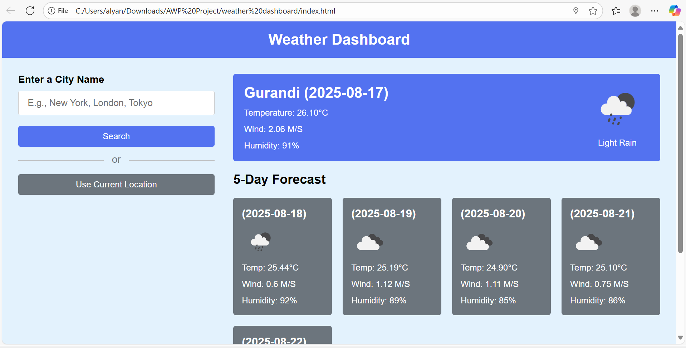

# weather---tracker
A simple and responsive **Weather Dashboard** that shows real-time weather details using the **OpenWeather API**.  
Built with **HTML, CSS, and JavaScript**.
## 🚀 Features
- 🌍 Search weather by city name
- 🌡️ Real-time temperature, humidity, and weather condition
- 📱 Responsive design (works on mobile & desktop)
- ⚡ Simple and lightweight UI

---

## 🛠️ Tech Stack
- **HTML5** – Structure  
- **CSS3** – Styling  
- **JavaScript (Vanilla JS)** – Functionality  
- **OpenWeather API** – Real-time weather data  

---
## 📸 Project UI
Here is a preview of the Weather Dashboard:

